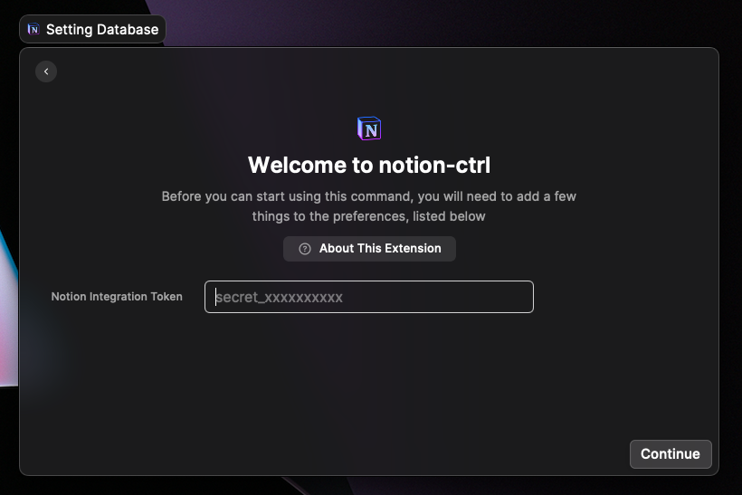

# Notion-ctrl

Notion のデータベースに素早くメモを保存できるようにする

## 使い方

### Notion Integration Token の発行

この拡張機能は [Notion API](https://developers.notion.com/) を使用しています。これを
使用するために Notion のアカウントで[My Integrations](https://www.notion.so/my-integrations)にアクセスし、Integration を作成します。


設定内容は画像のようにしてください。（デフォルトのままでも構いません）


作成し終えたら、Secrets/Internal Integration Token を取得します。

### Database の作成

次に保存先の Database を Notion で準備します。

`/database` と入力し、選択すると、Database が作成されます。（Inline と Full page のどちらでも構いません）

Database の properties の名前だけは以下で指定したものにしてください。

- `Name`を`title`にする
- `created at`はお好みで追加してください

最後に、Database ID を取得します。

`Copy link` からこの database ブロックのリンクをコピーしてください。（Full page の場合は Share の右下にあります）

以下のリンクの `da169b5851f34e48a97f263deee9ef85` 部分が Database ID になります。

```
sample: https://www.notion.so/xxxxx/da169b5851f34e48a97f263deee9ef85?v=d3cd4f2bc8fe40e7b0f38b44f3e29055
```

### Notion-ctrl 拡張機能の初期設定

上記で取得した Toke と ID の入力を初期画面で求められるので入力します。



間違って指定した or 変更する場合は、Raycast の Preferences（設定）から Extensions の Notion-ctrl を選択すると再設定できます。

### Raycast から Database に保存する

title のみ必須です。content に入力されたものは改行区切りで、ページ内のテキストブロックとして保存されます。

## 今後のアップデート予定

- 入力時に複数選択で tags を選択できるようにする
- 人力時に日付を入力できるようにする
- database の icon を表示
- info に Database の情報を表示
